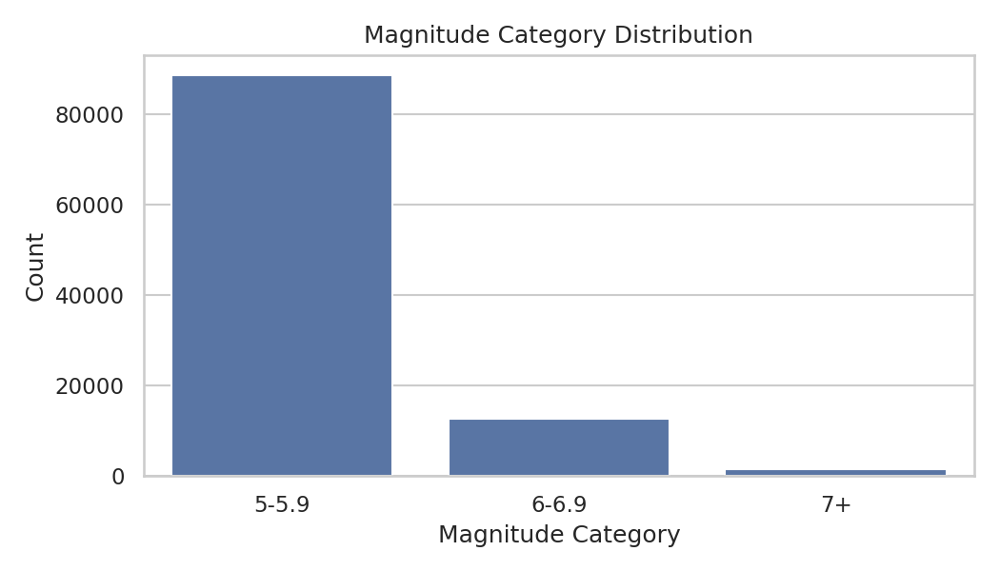
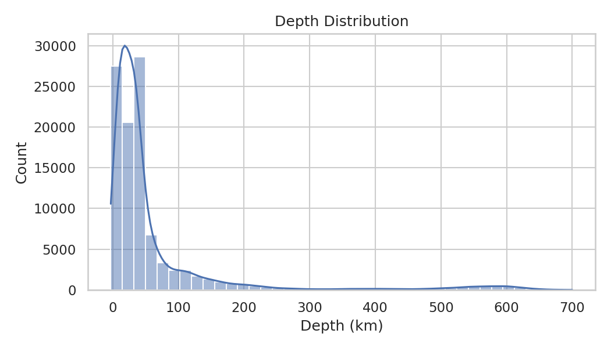
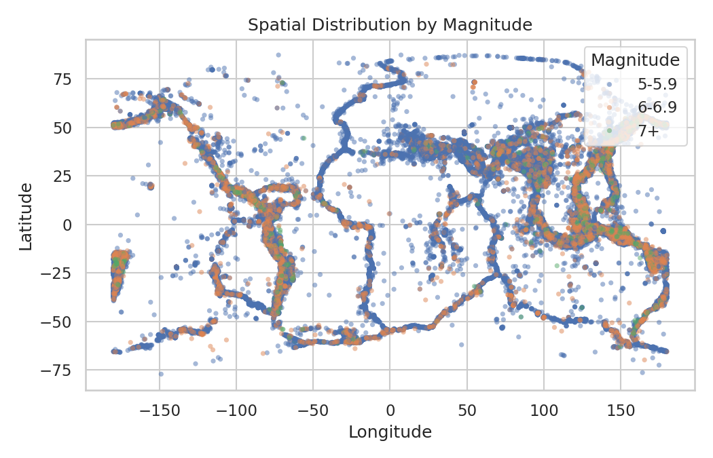

# Predicting Earthquakes Using 200 Years of Global Major Earthquakes

**Goal:** Predict earthquake magnitude category (5–5.9, 6–6.9, 7+) from location, depth, and time‑based features using historical data (1826–2026).

**Dataset:** 200 Years of Global Major Earthquakes (1826–2026) from Kaggle.
- https://www.kaggle.com/datasets/dhrubangtalukdar/200-years-of-global-major-earthquakes-18262026

## Setup

```sh
# Activating the conda environment
conda env create -f environment.yml
conda activate quake-ml

# Generate the processed dataset
python src/data_prep.py

# Start Jupyter from the repo root
jupyter notebook
```

## Results

### Best Model: Gradient Boosting

- Accuracy: 0.88
- Macro F1: 0.47
- Weighted F1: 0.86

## Analysis

- Temporal features were most important.
- Location and depth contributed moderately.
- Rare high‑magnitude classes (7+) remain harder to predict due to imbalance.

### Exploratory Data Analysis (EDA)

Run:

```sh
python src/eda.py
```

#### Magnitude Category Distribution



- High class imbalance: 5-5.9 magnitude earthquakes are most prevalent.
- 7+ magnitude rarity causes difficult recall.
- Macro F1 is more informative than accuracy given the skew.

#### Depth Distribution



- Depths between ~0-100 km are more prevalent than ~200 km+.
- The distribution is right-skewed with a long tail to ~700 km.

#### Spatial Distribution by Magnitude



- Events cluster in low-to-mid latitudes.
- Coverage spans most longitudes, so location features are meaningful.
- Spatial clustering reflect tectonic boundaries.

### Model‑Guided Analysis

## Permutation Importance (Gradient Boosting)

We used permutation importance to identify which features most influenced magnitude predictions.


- Time features rank highest in this model.
- Location and depth still contribute but are secondary.
- Temporal dominance may reflect catalog/reporting changes, so interpret with care.
